+++
title = '3DGS Tutorial'
date = 2024-05-23T20:31:53+08:00
draft = false
description = "深入探讨 3D 高斯分布（3D Gaussian Splatting）技术，包括基本原理、实现流程和优化方法。涵盖点基渲染、分块光栅化和球谐函数等核心概念。"
tags = ["Learning Note", "Deep Learning", "Computer Vision", "3DGS"]
categories = ["Learning"]
series = ["Learning Path"]
+++

# 3DGS

- 基本思想
  - 3D高斯分布可以通过它们的各向异性协方差矩阵、位置和透明度等参数来有效地表示复杂场景。由于这些参数是通过机器学习方法进行训练的，渲染阶段无需进行大量处理。因此，它可以利用基于瓦片的光栅化器实现快速渲染，从而在性能上有显著的提升。
  - 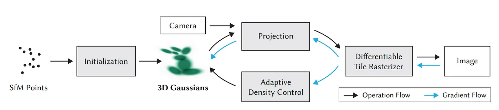
- 创新点
  - **Point-Based Rendering**：点基渲染直接将三维空间中的点渲染为图像。
  - **Tiled Rasterization**：分块光栅化的基本思想是将屏幕划分为多个小块（Tiles），然后在每个小块内进行相关计算和处理（可微分）。这种方法能够显著减少内存流量，从而提高渲染效率。
  - **Spherical Harmonics**：球谐函数是一种在球面上表示函数的方法，特别适用于描述球形表面的光照和阴影效果。

## 基本流程

1. 收集数据

   1. 图像

   2. 视频->ffmpeg截取视频帧

      1. ```Bash
         ffmpeg -i <VIDEO_PATH> -qscale:v 1 -qmin 1 -vf fps=2 %04d.jpg
         ```

   3. 输出如下

   4. ```Bash
      📦 $FOLDER_PATH
       ┣ 📂 input
       ┃ ┣ 📜 000000.jpg
       ┃ ┣ 📜 000001.jpg
       ┃ ┣ 📜 ...
      ```

2. 获取相机位姿

   1. [COLMAP](https://arc.net/l/quote/qyzmvpxq)：开源Structure-from-Motion (SfM) 软件，输入images，输出相机位姿

      1. > 原论文使用的是自带的convert.py，自动调用COLMAP并转换成需要的格式

   2. 桌面软件：[RealityCapture](https://www.capturingreality.com/), [Metashape](https://www.agisoft.com/)

   3. 移动app：[Polycam](https://poly.cam/), [Record3D](https://record3d.app/)（利用了雷达）

   4. 输出如下：

   5. ```Bash
      📦 $FOLDER_PATH
       ┣ 📂 (input)
       ┣ 📂 (distorted)
       ┣ 📂 images
       ┣ 📂 sparse
       ┃ ┣ 📂 0
       ┃ ┃ ┣ 📜 points3D.bin
       ┃ ┃ ┣ 📜 images.bin
       ┃ ┃ ┗ 📜 cameras.bin
      ```

3. 训练

   1. 整个训练过程（30,000步）大约需要30-40分钟，在完成7,000步之后会保存一个中间模型。

   2. 输出如下：

   3. ```Bash
      📦 $FOLDER_PATH
       ┣ 📂 images
       ┣ 📂 sparse
       ┣ 📂 output
       ┃ ┣ 📜 cameras.json
       ┃ ┣ 📜 cfg_args
       ┃ ┗ 📜 input.ply
       ┃ ┣ 📂 point_cloud
       ┃ ┃ ┣ 📂 iteration_7000
       ┃ ┃ ┃ ┗ 📜 point_cloud.ply
       ┃ ┃ ┣ 📂 iteration_30000
       ┃ ┃ ┃ ┗ 📜 point_cloud.ply
      ```

4. 可视化

   1. （官方）在Windows上安装预编译的SIBR viewer
   2. （官方）在Ubuntu 上构建SIBR viewer
   3. （第三方）[SuperSplat](https://playcanvas.com/supersplat/editor)，[Three.js](https://projects.markkellogg.org/threejs/demo_gaussian_splats_3d.php)

## 原理详解

### 光栅化：概述

- 对比NeRF（辐射场）

  - NeRF
    - $$\begin{aligned}&C(p)=\\&=\sum_{i=1}^Nc_i(1-\exp(-\sigma_i\delta_i))T_i=\\&=\sum_{i=1}^Nc_i(1-\exp(-\sigma_i\delta_i))\exp(-\sum_{j=1}^{i-1}\sigma_j\delta_j)=&(1)\\&=\sum_{i=1}^Nc_i\underbrace{(1-\exp(-\sigma_i\delta_i))}_{\alpha_i}\prod_{j=1}^{i-1}\underbrace{\exp(-\sigma_j\delta_j)}_{1-\alpha_j}=\\&=\sum_{i=1}^Nc_i\alpha_i\underbrace{\prod_{j=1}^{i-1}(1-\alpha_j)}_{transmittance}&(2)\end{aligned}$$
  - 3DGS

    - $$C(p)=\sum_{i\in N}c_if_i^{2D}(p)\underbrace{\prod_{j=1}^{i-1}(1-f_j^{2D}(p))}_{transmittance}\quad(3)$$

    - 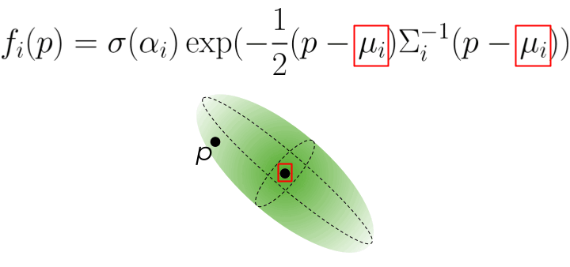

公式（3）描述了如何在一个像素中获得颜色值。要渲染整个图像，仍然需要遍历所有的H×W射线，就像在 NeRF 中一样。不过，这个过程更加轻量化：

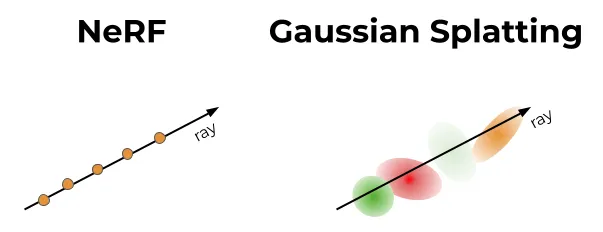

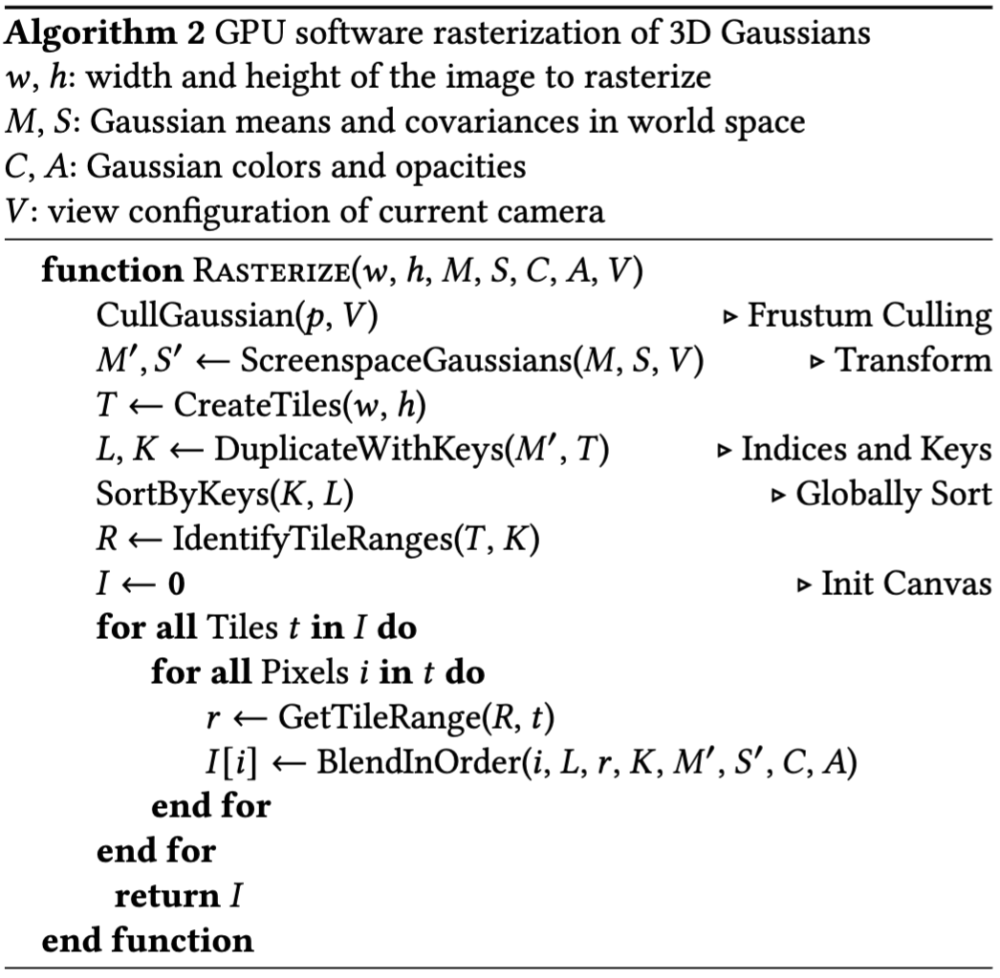

1. 预处理排序阶段：
   1. 每帧只需在GPU上进行一次预处理排序，使用定制的可微分CUDA 内核实现。这一步骤可以显著加速渲染过程，因为它利用了 GPU 的并行计算能力。
   2. 在这一步骤中，所有的三维点根据它们在二维图像平面上的投影位置进行排序，以便快速查找和混合。
   3. 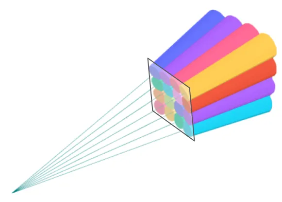
2. 预先投影到2D：
   1. 对于给定的相机，可以提前将每个三维点的f（p）投影到二维。在遍历像素之前完成这个步骤，这样当高斯函数混合到附近的几个像素时，不需要一遍又一遍地重新投影。
   2. 例如，假设有一个三维点（X，Y，2），在给定相机内参和外参矩阵的情况下，可以提前计算出该点在图像平面上的投影位置（2,g）。
3. 直接混合2D高斯：
   1. 不需要为每个像素、每条射线、每个三维点运行多层感知机（MLP）模型推断。相反，二维高斯函数可以直接混合到图像上。
   2. 这意味着在渲染过程中，计算量大大减少，因为不再需要运行复杂的神经网络推断。
4. 固定的三维点集：
   1. 没有模糊性，不需要沿射线选择三维点进行评估，也不需要选择射线采样策略。每个像素的射线重叠的三维点集（公式（3）中的N）在优化后是离散且固定的。
   2. 例如，假设某个像素的射线经过了几个三维点，这些点在优化之后是固定的，因此可以直接使用这些点进行渲染，而不需要每次重新采样。

### 光栅化：实现细节（前向传播）

3D高斯体通过投影矩阵转换到二维相机平面上，获得其投影位置和范围，接着根据深度进行排序，并且从前到后按照不透明度和颜色进行alpha混合，最终组合生成输出图像。

一个三维高斯分布由以下参数化：

- **均值** $\mu \in \mathbb{R}^3$：三维空间中的位置。
- **协方差** $\Sigma \in \mathbb{R}^{3 \times 3}$：描述高斯分布的形状和方向。
- **颜色** $c \in \mathbb{R}^3$：颜色向量，通常表示为 RGB 值。
- **不透明度** $o \in \mathbb{R}$：描述高斯分布的透明度。

#### **高斯分布的投影（3D->2D）**

1. 世界坐标系转->相机坐标系

   1. 渲染相机由其外参 $T_{cw} $描述，它将点从世界坐标系转换到相机坐标系，以及其内参（焦距 $f_x, f_y $和相机平面主点 $(c_x, c_y)$）。我们使用投影矩阵 P 将相机空间的转换到标准化剪辑空间。

   2. $$T_{cw} = \begin{bmatrix} R_{cw} & t_{cw} \\ 0 & 1 \end{bmatrix} \in SE(3), \quad P = \begin{bmatrix} \frac{2f_x}{w} & 0 & 0 & 0 \\ 0 & \frac{2f_y}{h} & 0 & 0 \\ 0 & 0 & \frac{f+n}{f-n} & \frac{-2fn}{f-n} \\ 0 & 0 & 0 & 1 \end{bmatrix}$$

   3. 其中 w, h 是输出图像的宽度和高度，n, f 是近剪裁平面和远剪裁平面。我们通过标准透视投影将三维均值 \mu 投影到像素空间。我们将均值 \mu 转换为相机坐标系中的 $t \in \mathbb{R}^4$，在标准化设备坐标中的 $t' \in \mathbb{R}^4$，以及在像素坐标中的 $\mu' \in \mathbb{R}^2$。

   4. $$t = T_{cw} \begin{bmatrix} \mu \\ 1 \end{bmatrix}^T, \quad t' = Pt, \quad \mu' = \left[ \begin{array}{c} (w \cdot \frac{t'_x}{t'_w} + 1)/2 + c_x \\ (h \cdot \frac{t'_y}{t'_w} + 1)/2 + c_y \end{array} \right]$$

   5. 其中 w 和 h 分别是输出图像的宽度和高度。

2. 三维高斯->二维高斯

   1. 透视投影一个三维高斯分布并不会产生二维高斯分布。我们使用一阶泰勒展开近似在相机坐标系中的 t 处的投影。具体来说，我们计算仿射变换矩阵 $J \in \mathbb{R}^{2 \times 3} $如下：

   2. $$J = \begin{bmatrix} \frac{f_x}{t_z} & 0 & -\frac{f_x \cdot t_x}{t_z^2} \\ 0 & \frac{f_y}{t_z} & -\frac{f_y \cdot t_y}{t_z^2} \end{bmatrix}$$

   3. 二维协方差矩阵 $\Sigma' \in \mathbb{R}^{2 \times 2}$ 由下式给出：

   4. $\Sigma' = JR_{cw} \Sigma R_{cw}^T J^T$

   5. 最后，我们用尺度 $s \in \mathbb{R}^3$ 和旋转四元数 $q \in \mathbb{R}^4$ 来参数化三维协方差$ \Sigma$ 。我们首先将四元数 $q = (x, y, z, w) $转换为旋转矩阵：

   6. $$R = \begin{bmatrix} 1 - 2(y^2 + z^2) & 2(xy - wz) & 2(xz + wy) \\ 2(xy + wz) & 1 - 2(x^2 + z^2) & 2(yz - wx) \\ 2(xz - wy) & 2(yz + wx) & 1 - 2(x^2 + y^2) \end{bmatrix}$$

   7. 三维协方差$ \Sigma $由下式给出：

   8. $$\Sigma = RS S^T R^T$$

   9. 其中 $S = \text{diag}(s) \in \mathbb{R}^{3 \times 3}$。

#### 高斯分布的深度合成（alpha-blending 计算像素点颜色）

将二维高斯分布划分到 16×16 的瓦片中，并按深度对每个瓦片中的高斯分布进行排序。对于每个高斯分布，我们计算其二维投影协方差（3 sigma）周围的轴对齐边界框，并在其边界框与瓦片相交时将其包括在瓦片中。然后我们应用 [Kerbl et al., 2023] 附录 C 中提出的瓦片排序算法，得到按深度排序的每个瓦片的高斯分布列表。

- 步骤

  - 栅格化每个瓦片中排序后的高斯分布。对于像素 $i$ 的颜色，让 $n$ 索引涉及该像素的 $N$ 个高斯分布：

  - $$C_i = \sum_{n \leq N} c_n \cdot \alpha_n \cdot T_n， 其中 T_n = \prod_{m < n} (1 - \alpha_m)。$$

  - 我们用二维协方差 $\Sigma' \in \mathbb{R}^{2 \times 2}$ 和不透明度参数计算 $\alpha$：

  - $$\alpha_n = o_n \cdot \exp(-\sigma_n)， \quad \sigma_n = \frac{1}{2} \Delta_n^T \Sigma'^{-1} \Delta_n，$$

  - 其中 $\Delta \in \mathbb{R}^2$ 是像素中心与二维高斯分布中心 $\mu' \in \mathbb{R}^2$ 之间的偏移量。我们在从前到后的过程中计算 $T_n$。

- 公式解释

  - **颜色计算公式**：

    1.  $C_i = \sum_{n \leq N} c_n \cdot \alpha_n \cdot T_n$，其中 $T_n = \prod_{m < n} (1 - \alpha_m)$。

    2.  $c_n$：第 $n$ 个高斯分布的颜色。
    3.  $\alpha_n$：第 $n$ 个高斯分布的累积不透明度。
    4.  $T_n$：前 $n-1$ 个高斯分布的不透明度积的乘积，表示第 $n$ 个高斯分布的可见度。

  - **不透明度计算**：

    1.  $\alpha_n = o_n \cdot \exp(-\sigma_n)$

    2.  $o_n$：第 $n$ 个高斯分布的初始不透明度。
    3.  $\sigma_n$：偏移量的平方距离乘以协方差矩阵的逆。

  - **偏移量计算**：

    1.  $$\sigma_n = \frac{1}{2} \Delta_n^T \Sigma'^{-1} \Delta_n$$

    2.  $\Delta_n$：像素中心与高斯分布中心之间的偏移量。
    3.  $\Sigma'^{-1}$：二维协方差矩阵的逆。

### 优化：概述

要从空间中的一堆高斯点获得高质量的图像，需要三个关键组件：良好的初始化、可微分优化和自适应密集化。这些组件可以帮助减少渲染中的尖锐伪影，使图像更平滑和真实。

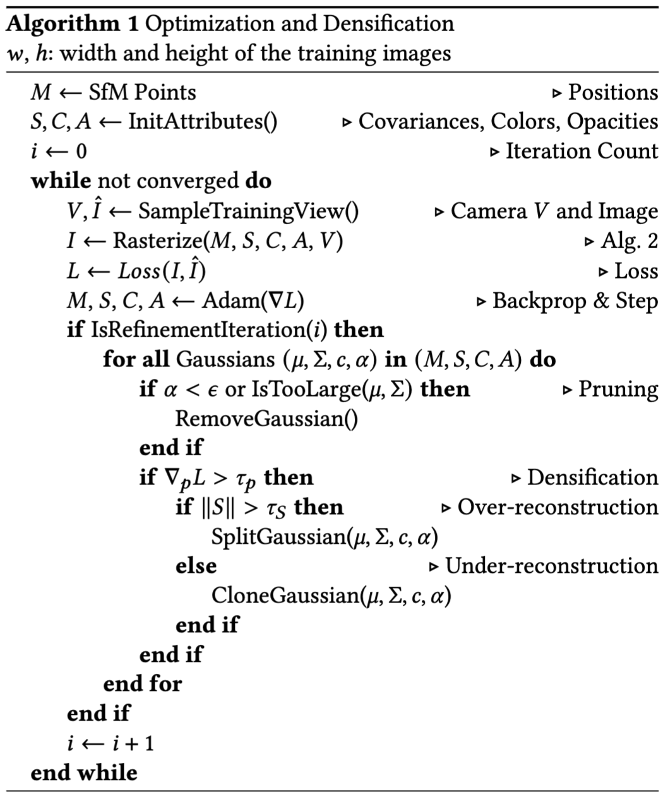

1. 初始化

   1. 初始化是指在训练开始时设置三维点的参数。初始化的质量对最终渲染效果至关重要。本文建议使用由 SfM（Structure from Motion）生成的点云来初始化三维点的位置（均值）。SfM 是一种通过分析多张图像来重建三维结构的方法，它可以生成稀疏的点云。

   2. 使用 SfM 生成的点云：
      - SfM 通过相机矩阵和多张图像生成三维点云。
      - 这些点云可以用来初始化高斯点的位置，因为它们已经是从真实场景中重建出来的。
   3. 随机初始化：
      - 在初始化时，每个3D点被视为一个球体（即各向同性的协方差矩阵）。
      - 半径的设置基于与相邻点的平均距离，以确保3D世界被适当地覆盖，没有“空洞”。
   4. 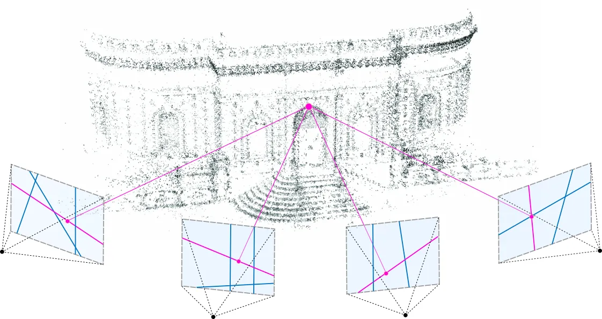

2. 可微分优化

   1. 在初始化之后，使用简单的随机梯度下降（SGD）来进行优化。场景通过最小化损失函数进行优化，该损失函数是L1损失和结构相似性指数（D-SSIM）损失的组合，用于衡量当前渲染图像与真实图像之间的差异。

   2. 损失函数
      - L1 损失：L1损失度量渲染图像和真实图像之间像素值的绝对差异。
      - D-SSIM 损失：结构相似性指数（SSIM）用于衡量图像的结构相似性。D-SSIM 是其反向度量，用于衡量图像之间的结构不相似性。

3. 自适应密集化

   1. 自适应密集化是优化过程中的一个关键部分，用于解决过度重建和不足重建的问题。自适应密集化在训练期间每隔一段时间（例如每100次SGD步）启动一次。其目的是在现有点无法适当覆盖场景的区域，动态调整点的密度。

   2. 点密集化：
      - 在具有大梯度的区域分裂点或克隆点。这些区域通常表示高变化率或复杂细节区域，因此需要更多的点来准确表示。对于克隆，创建高斯的复制体并朝着位置梯度移动。对于分裂，用两个较小的高斯替换一个大高斯，按照特定因子减小它们的尺度。
   3. 点的剪枝：
      - 移除那些α值非常低的点。如果一个点的透明度非常高，表示其对最终渲染的贡献很小，因此可以安全地移除这些点以减少计算复杂度。
   4. 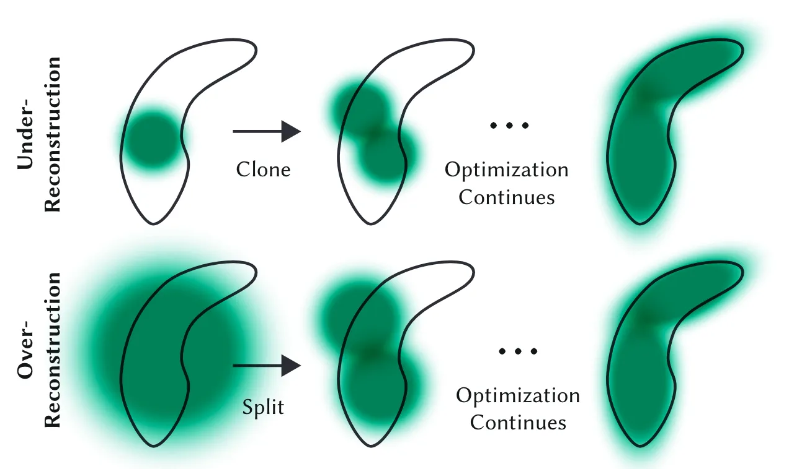

### 优化：实现细节（反向传播计算梯度）

给定标量损失 $\mathcal{L}$ 相对于输出图像每个像素的梯度，我们使用标准链式法则将梯度向后传播到原始输入参数。

- Frobenius 内积

  - 在下面的推导中，我们将使用 Frobenius 内积来导出矩阵的导数：

  - $$\langle X, Y \rangle = \text{Tr}(X^T Y) = \text{vec}(X)^T \text{vec}(Y) = \in \mathbb{R},$$

  - 它可以被看作是矩阵点积。Frobenius 内积具有以下性质：

  - $$\begin{aligned}    \langle X, Y \rangle &= \langle Y, X \rangle, \\    \langle X, Y \rangle &= \langle X^T, Y^T \rangle, \\    \langle X, YZ \rangle &= \langle Y^T X, Z \rangle = \langle X Z^T, Y \rangle, \\    \langle X, Y + Z \rangle &= \langle X, Y \rangle + \langle X, Z \rangle. \end{aligned}$$

  - 假设我们有一个标量函数 $f$ 使 $X\in \mathbb{R}^{m \times n}$，且 $X = A$，其中 $A \in \mathbb{R}^{m \times p}$ 和 $Y \in \mathbb{R}^{p \times n}$。我们可以写出 $f$ 相对于任意标量 $x \in \mathbb{R}$ 的梯度：

  - $$\frac{\partial f}{\partial x} = \left\langle \frac{\partial f}{\partial X}, \frac{\partial X}{\partial x} \right\rangle,$$

  - 我们使用简写：

  - $$\partial f = \left\langle \frac{\partial f}{\partial X}, \partial X \right\rangle.$$

  - 这里，$\frac{\partial f}{\partial x} \in \mathbb{R}$，$\frac{\partial f}{\partial X} \in \mathbb{R}^{m \times n}$，和 $\frac{\partial X}{\partial x} \in \mathbb{R}^{m \times n}$。

  - 在这种情况下，继续使用链式法则非常简单。设 $G = \frac{\partial f}{\partial X$，我们有：

  - $$\begin{aligned}    \frac{\partial f}{\partial x} &= \left\langle G, \frac{\partial (AY)}{\partial x} \right\rangle \\    &= \left\langle G, \frac{\partial A}{\partial x} Y \right\rangle + \left\langle G, A \frac{\partial Y}{\partial x} \right\rangle \\    &= \left\langle G Y^T, \frac{\partial A}{\partial x} \right\rangle + \left\langle A^T G, \frac{\partial Y}{\partial x} \right\rangle. \end{aligned}$$

  - 从这里，我们可以得到 $f$ 相对于 $A$ 和 $Y$ 的梯度的元素：

  - $$\frac{\partial f}{\partial A} = G Y^T \in \mathbb{R}^{m \times p}, \quad \frac{\partial f}{\partial Y} = A^T G \in \mathbb{R}^{p \times n}.$$

#### 高斯分布深度合成的梯度计算

我们从将像素 $i$ 的损失梯度向后传播到贡献该像素的高斯分布开始。具体来说，对于像素 $i$ 贡献的高斯分布 $i$，我们计算颜色 $\frac{\partial \mathcal{L}}{\partial c_n} \in \mathbb{R^3}$、不透明度 $\frac{\partial \mathcal{L}}{\partial o_n} \in \mathbb{R}$、二维均值 $\frac{\partial \mathcal{L}}{\partial \mu_n'} \in \mathbb{R}^2$ 和二维协方差 $\frac{\partial \mathcal{L}}{\partial \Sigma_n'} \in \mathbb{R}^{2 \times 2}$ 的梯度。

1. 对于每个通道 $k$的颜色，我们有：

   1. $$\frac{\partial C_i(k)}{\partial c_n(k)} = \alpha_n \cdot T_n$$

   2. 我们保存正向传播过程中计算的最终 $T_N$ 值，并在反向传播过程中计算下一个 $T_{n-1}$ 值：

   3. $$T_{n-1} = \frac{T_n}{1 - \alpha_{n-1}}$$

   4. 对于每个通道 $k$上 $\alpha$ 的梯度，我们有标量梯度：

   5. $$\frac{\partial C_i(k)}{\partial \alpha_n} = c_n(k) \cdot T_n - \frac{S_n(k)}{1 - \alpha_n}$$

   6. 其中，$$S_n = \sum_{m>n} c_m \alpha_m T_m$$

   7. 我们可以在反向传播过程中计算 $S_{n-1}$：

   8. $$S_N(k) = 0$$

   9. $$S_{n-1}(k) = c_n(k)\alpha_n T_n + S_n(k)$$

2. 对于不透明度$o$和 $\sigma$：

   1. 我们有标量梯度：

   2. $$\frac{\partial \alpha_n}{\partial o_n} = \exp(-\sigma_n), \quad \frac{\partial \alpha_n}{\partial \sigma_n} = -o_n \exp(-\sigma_n)$$

3. 对于二维均值：

   1. 我们有雅可比矩阵：

   2. $$\frac{\partial \sigma_n}{\partial \mu_n'} =  \frac{\partial \sigma_n}{\partial \Delta_n} = \Sigma_n'^{-1} \Delta_n \in \mathbb{R}^2$$

4. 对于二维协方差：

   1. 我们令 $Y = \Sigma_n'^{-1}$，其雅可比矩阵从 $\sigma_n$ 直接得出：

   2. $$\frac{\partial \sigma_n}{\partial Y} = \frac{1}{2} \Delta_n \Delta_n^T \in \mathbb{R}^{2 \times 2}$$

   3. 为了继续通过 $Y \in \mathbb{R}^{2 \times 2}$ 进行反向传播，我们令 $G = \frac{\partial \sigma_n}{\partial Y}$ 并写出相对于标量变量 $x$ 的梯度：

   4. $$\frac{\partial \sigma_n}{\partial x} = \langle G, \frac{\partial Y}{\partial x} \rangle$$

   5. 我们使用 [Petersen et al., 2008, Dwyer and McPhail, 1948] 的等式，得到：

   6. $$\begin{aligned}\frac{\partial \sigma_n}{\partial x} = \langle G, -Y \frac{\partial \Sigma_n'^{-1}}{\partial x} Y \rangle \\ = \langle -Y^T G Y^T, \frac{\partial \Sigma_n'}{\partial x} \rangle \end{aligned}$$

   7. 因此，相对于 $\Sigma_n$ 的梯度为：

   8. $$\frac{\partial \sigma_n}{\partial \Sigma_n'} = -\frac{1}{2} \Sigma_n'^{-1} \Delta_n \Delta_n^T \Sigma_n'^{-1}$$

#### 高斯分布投影的梯度计算（2D->3D）

给定损失函数 $\mathcal{L}$ 相对于投影后的二维均值 $\mu$ 和协方差 $\Sigma$ 的梯度，我们可以继续反向传播单个高斯分布的三维均值 $\m$ 和协方差 $\Sigm$ 的梯度。在此，我们一次只处理一个高斯分布，因此省略下标 𝑛，并通过$\begin{array}{l}\frac{\partial\mathcal{L}}{\partial\mu'}\in\mathbb{R}^2，\frac{\partial\mathcal{L}}{\partial\Sigma'}\in\mathbb{R}^{2\times2}\end{array}$计算梯度$\begin{array}{l}\frac{\partial\mathcal{L}}{\partial\mu}\in\mathbb{R}^3，\frac{\partial\mathcal{L}}{\partial\Sigma}\in\mathbb{R}^{3\times3}\end{array}$

1. 计算二维均值 $\mu$ 对相机坐标 $t \in \mathbb{R}^4$ 和二维协方差 $\Sigma'$ 对三维协方差 $\Sigma$ 及相机坐标 $t$的梯度贡献。

   1. > 注意，$\mu$ 和 $\Sigma$ 都对 $t$ 的梯度有贡献

   2. $$\frac{\partial\mathcal{L}}{\partial t_i}=\frac{\partial\mathcal{L}_{\mu^{\prime}}}{\partial t_i}+\frac{\partial\mathcal{L}_{\Sigma^{\prime}}}{\partial t_i}=\frac{\partial\mathcal{L}}{\partial\mu^{\prime}}\frac{\partial\mu^{\prime}}{\partial t_i}+\langle\frac{\partial\mathcal{L}}{\partial\Sigma^{\prime}},\frac{\partial\Sigma^{\prime}}{\partial t_i}\rangle$$

   3. 对于二维均值 $\mu$，我们有：

      - $$\frac{\partial\mathcal{L}_{\mu^{\prime}}}{\partial t}=\frac12P^\top\begin{bmatrix}w/t_w&0&0&-w\cdot t_x/t_w^2\\0&h/t_w&0&-w\cdot t_y/t_w^2\end{bmatrix}^\top\frac{\partial\mathcal{L}}{\partial\mu^{\prime}}$$

   4. 对于二维协方差 $\Sigma'$ 对 $\Sigma$ 和 $t$ 的梯度贡献，$\Sigma'=T\Sigma T^\top$。设 $G = \frac{\partial \mathcal{L}}{\partial \Sigma'}$，我们有：

      - $\begin{aligned}\partial\mathcal{L}_{\Sigma^{\prime}}&=\langle G,\partial\Sigma^{\prime}\rangle\\&=\langle G,(\partial T)\Sigma T^\top+T(\partial\Sigma)T^\top+T\Sigma(\partial T^\top)\rangle\\&=\langle GT\Sigma^\top,\partial T\rangle+\langle T^\top GT,\partial\Sigma\rangle+\langle G^\top T\Sigma,\partial T\rangle\\&=\langle GT\Sigma^\top+G^\top T\Sigma,\partial T\rangle+\langle T^\top GT,\partial\Sigma\rangle.\end{aligned}$

2. 计算相对于协方差矩阵 Σ 的梯度，

   1. $$\frac{\partial \mathcal{L}}{\partial \Sigma} = T^T \frac{\partial \mathcal{L}}{\partial \Sigma'} T$$

   2. 我们继续通过 $T = J R_{cw} \in \mathbb{R}^{2 \times 3}$ 传播梯度，对于 $J$ 的梯度，令：

   3. $$\partial\mathcal{L}=\langle\frac{\partial\mathcal{L}}{\partial T},(\partial J)R_{\mathrm{cw}}\rangle=\langle\frac{\partial\mathcal{L}}{\partial T}R_{\mathrm{cw}}^\top,\partial J\rangle,\quad\mathrm{where~}\frac{\partial\mathcal{L}}{\partial T}=\frac{\partial\mathcal{L}}{\partial\Sigma^{\prime}}T\Sigma^\top+\frac{\partial\mathcal{L}}{\partial\Sigma^{\prime}}^\top T\Sigma$$

   4. 我们继续通过 $J$ 对相机坐标 $t \in \mathbb{R}^4$ 的贡献进行反向传播：

   5. $\frac{\partial J}{\partial t_x}=\begin{bmatrix}0&0&-f_x/t_z^2\\0&0&0\end{bmatrix},\quad\frac{\partial J}{\partial t_y}=\begin{bmatrix}0&0&0\\0&0&-f_y/t_z^2\end{bmatrix},\quad\frac{\partial J}{\partial t_z}=\begin{bmatrix}-f_x/t_z^2&0&2f_xt_x/t_z^3\\0&-f_y/t_z^2&2f_yt_y/t_z^3\end{bmatrix},\quad\frac{\partial J}{\partial t_w}=\mathbf{0}^{2\times3}$

   6. 我们现在可以将两个梯度 $\frac{\partial \mathcal{L_{\mu'}}}{\partial t}$ 和 $\frac{\partial \mathcal{L_{\Sigma'}}}{\partial t}$ 合并为 $G = \frac{\partial \mathcal{L}}{\partial t}$ 并计算相对于三维均值 $\mu$和视图矩阵 $T_{cw}$ 的全梯度。且有$t=T_\text{cw}q,\text{ where }q=\begin{bmatrix}\mu&1\end{bmatrix}^\top$

   7. $$\begin{aligned}\partial\mathcal{L}&=\langle G,\partial t\rangle=\langle G,\partial(T_\text{cw}q)\rangle\\&=\langle Gq^\top,\partial T_{\mathrm{cw}}\rangle+\langle T_{\mathrm{cw}}^\top G,\partial q\rangle\end{aligned}$$

   8. 相对于 $\mu$ 和 $T_{cw}$ 的梯度：

   9. $$\frac{\partial\mathcal{L}}{\partial T_{\mathrm{cw}}}=\frac{\partial\mathcal{L}}{\partial t}q^\top\in\mathbb{R}^{4\times4},\quad\frac{\partial\mathcal{L}}{\partial\mu}=R_{\mathrm{cw}}^\top\begin{bmatrix}\frac{\partial\mathcal{L}}{\partial t_x}&\frac{\partial\mathcal{L}}{\partial t_y}&\frac{\partial\mathcal{L}}{\partial t_z}\end{bmatrix}^\top\in\mathbb{R}^3$$

3. 尺度和旋转梯度

   1. 现在我们有 $\Sigma = M M^3$ 和 $\frac{\partial \mathcal{L}}{\partial \Sigma} $。设 $G = \frac{\partial \mathcal{L}}{\partial \Sigma}$，我们有：

   2. $$\begin{aligned}\partial\mathcal{L}&=\langle G,\partial\Sigma\rangle\\&=\langle G,(\partial M)M^\top+M(\partial M^\top)\rangle\\&=\langle GM+G^\top M,\partial M\rangle\end{aligned}$$

   3. 这给我们：

   4. $$\frac{\partial \mathcal{L}}{\partial M} = \frac{\partial \mathcal{L}}{\partial \Sigma} M + \frac{\partial \mathcal{L}}{\partial \Sigma}^T M $$

   5. 现在我们有 $M = R $，并且 $G = \frac{\partial \mathcal{L}}{\partial M}$，所以：

   6. $$\begin{aligned}\partial\mathcal{L}&=\langle G,\partial M\rangle\\&=\langle G,(\partial R)S\rangle+\langle G,R(\partial S)\rangle\\&=\langle GS^\top,\partial R\rangle+\langle R^\top G,\partial S\rangle\end{aligned}$$

   7. 这给我们：

   8. $$\frac{\partial \mathcal{L}}{\partial R} = \frac{\partial \mathcal{L}}{\partial M} S^T, \quad \frac{\partial \mathcal{L}}{\partial S} = R^T \frac{\partial \mathcal{L}}{\partial M} $$

   9. 旋转矩阵 $R$ 关于四元数参数 $q = (w, x, y, z)$ 的雅可比矩阵是：

   10. $$\frac{\partial R}{\partial w} = 2 \begin{bmatrix} 0 & -z & y \\ z & 0 & -x \\ -y & x & 0 \end{bmatrix}, \quad \frac{\partial R}{\partial x} = 2 \begin{bmatrix} 0 & y & z \\ y & -2x & -w \\ z & w & -2x \end{bmatrix}$$

   11. $$\frac{\partial R}{\partial y} = 2 \begin{bmatrix} -2y & x & w \\ x & 0 & z \\ w & z & -2y \end{bmatrix}, \quad \frac{\partial R}{\partial z} = 2 \begin{bmatrix} -2z & -w & x \\ w & -2z & y \\ x & y & 0 \end{bmatrix}$$

   12. 尺度矩阵 $S$ 关于尺度参数 $s = (s_x, s_y, s_z)$ 的雅可比矩阵是：

   13. $$\frac{\partial S}{\partial s_j} = \delta_{ij}$$

   14. 其中选择相应的对角元素 $\frac{\partial \mathcal{L}}{\partial S}$。

### EX：球谐函数

> 球谐函数在3DGS中并不是必须的


- **球谐函数（Spherical Harmonics, SH）**

  - 球谐函数被用来表示视角依赖的颜色，这样可以更好地处理非朗伯反射（如金属表面的镜面反射）。具体来说，通过限制自由度 $\ell_{\text{max}}$，每个颜色（红、绿、蓝）可以表示为前$ \ell\_{\text{max}}$ 个球谐函数的线性组合。

  - 球谐函数是一组定义在球面上的特殊函数，通过选择正整数 $\ell$ 和 $-\ell \leq m \leq \ell$ 的一对 $(\ell, m)$，可以从一个通用公式中导出这些函数。

- **公式解释**

  - 球谐函数的通用公式为：

  - $$Y_\ell^m (\theta, \phi) = (-1)^m \sqrt{\frac{(2\ell + 1)(\ell - m)!}{4\pi (\ell + m)!}} P_\ell^m (\cos \theta) e^{im\phi}$$

  - 其中：

  - $\ell $和 m 是整数，$\ell \geq 0，-\ell \leq m \leq \ell$。
  - $\theta$ 是极角（通常在0到$\pi$之间），$\phi$ 是方位角（通常在0到$2\pi$之间）。
  - $P_\ell^m$ 是缔合勒让德多项式（Associated Legendre Polynomials）。
  - **球谐函数的性质**
    - **正交性**： 球谐函数是正交的，这意味着在球面上的任意两个不同的球谐函数在积分意义下相互独立。
    - **归一化**： 球谐函数是归一化的，因此可以形成球面上函数空间的正交基。
    - **简化**： 对于小的$\ell $值，球谐函数公式会显著简化。例如，当 $\ell $ = 0 时，球谐函数是一个常数，当 $\ell $ = 1 时，球谐函数也是相对简单的形式。

- **颜色表示**

  - 对于每个三维高斯点，我们希望学习正确的系数，使得从某个方向看该三维点时，它传达的颜色最接近真实颜色。这是通过以下步骤实现的：

  - **选择最大自由度**：
    1.  选择一个适当的$ \ell\_{\text{max}}$ 值，以限制球谐函数的数量。
  - **线性组合**：
    1.  每种颜色（红、绿、蓝）都表示为前$ \ell\_{\text{max}} $个球谐函数的线性组合。对于每个三维高斯点，学习这些线性组合的系数。
  - **视角依赖的颜色计算**：
    1.  给定一个观察方向，使用球谐函数和学习到的系数计算该方向上的颜色。

- **示例**

  - 假设我们选择 $\ell_{\text{max}}=2$，则有 5 个球谐函数（$\ell $= 0, 1, 2 对应的各个 m 值）。我们需要为每个颜色学习 5 个系数。假设对于某个高斯点，这些系数为 $c_{r,i}, c_{g,i}, c_{b,i}$（红、绿、蓝）。

  - 对于一个特定的观察方向 $(\theta, \phi)$，我们可以计算该方向上的颜色：

  - $$\text{Color}(\theta, \phi) = \left( \sum_{i=1}^5 c_{r,i} Y_i(\theta, \phi), \sum_{i=1}^5 c_{g,i} Y_i(\theta, \phi), \sum_{i=1}^5 c_{b,i} Y_i(\theta, \phi) \right)$$

- **总结**
  - 球谐函数提供了一种有效的方法来表示视角依赖的颜色，使得模型能够处理非朗伯反射效果。在具体实现中，通过选择适当的 $\ell_{\text{max}}$，并学习每个颜色的球谐函数系数，可以实现高质量的渲染效果。球谐函数的正交性和归一化性质保证了这种表示的数学稳健性和计算效率。

## 资源消耗

### 数据准备（快）

- 使用COLMAP从图像集合中提取SfM信息

### 训练（较慢）

| GPU                             | NVIDIA RTX 4090           |                          |           |                |
| ------------------------------- | ------------------------- | ------------------------ | --------- | -------------- |
| 显存                            | 24 GB                     |                          |           |                |
| 场景                            | drjohnson                 | playroom                 | bottle    | scene(dynamic) |
| 图片数量                        | 263                       | 225                      | 48        | 105            |
| 图片分辨率(px)                  | 1332x876                  | 1264x832                 | 1081x1932 | 1065x1895      |
| 训练时间                        | 41 min                    | 17 min                   | 17 min    | 22 min         |
| `.ply` 文件大小（7000 次迭代）  | 423 MB（1,789,615个顶点） | 403MB（1,618,690个顶点） | 48MB      | 136MB          |
| `.ply` 文件大小（30000 次迭代） | 812 MB（3,433,974个顶点） | 587MB（2,356,284个顶点） | 54MB      | 324MB          |

> 1个顶点约0.25KB
>
> - 高斯核均值信息$\mu$：x, y, z 位置信息
> - 协方差矩阵$\Sigma$：3x3矩阵，表示高斯核的缩放+旋转
> - 透明度$\alpha$
> - SH球谐函数颜色信息：48个（只用到前4阶）

### 渲染（快）

| GPU               | Apple M1 Pro       |                  |
| ----------------- | ------------------ | ---------------- |
| Render window     | 1920x1080（1080p） | 2268x1420（~2K） |
| FPS（2M～3M顶点） | 50～60 FPS         | 20～30 FPS       |
| FPS（1M～2M顶点） | 60+ FPS            | 30～40 FPS       |

> 由于mac不支持3DGS源代码提供的SIMR viewer，因此目前采用的是基于WebGL的方式（[SuperSplat](https://playcanvas.com/supersplat/editor)，[Three.js](https://projects.markkellogg.org/threejs/demo_gaussian_splats_3d.php)），如果在windows平台上通过官方渲染程序运行应该会更快。

# 数据集

| 数据集名称      | 描述                                                                                                                                  | 来源                                                        |
| --------------- | ------------------------------------------------------------------------------------------------------------------------------------- | ----------------------------------------------------------- |
| LLFF            | 本地光场融合（LLFF）数据集包括自然场景的合成图像和真实图像。合成图像由SUNCG和UnrealCV生成，而真实图像包括使用手持手机拍摄的24个场景。 | [链接](https://bmild.github.io/llff/)                       |
| NeRF            | 神经辐射场（NeRF）数据集包含复杂场景的合成渲染和真实图像。它包括漫射合成360°、真实合成360°和复杂场景的真实图像。                      | [链接](https://www.matthewtancik.com/nerf)                  |
| DONeRF          | DONeRF数据集包括使用Blender和Cycles路径追踪器生成的合成数据，每个场景渲染300张图像。                                                  | [链接](https://depthoraclenerf.github.io/)                  |
| X3D             | X3D数据集包括15个专用于X射线3D重建的场景，涵盖医学、生物学、安全和工业应用。                                                          | [链接](https://github.com/caiyuanhao1998/SAX-NeRF)          |
| RTMV            | RTMV是一个用于新视图合成的合成数据集，包括通过光线追踪生成的300,000张图像，涵盖2,000个场景。                                          | [链接](https://www.cs.umd.edu/~mmeshry/projects/rtmv/)      |
| Tanks&Temples   | Tanks&Temples数据集是综合性的，提供了用于基于图像的3D重建管道的中级和高级测试数据集。                                                 | [链接](https://www.tanksandtemples.org/)                    |
| RealEstate10K   | RealEstate10K是一个大型数据集，从10,000个YouTube视频中获取相机位姿，提供通过SLAM和捆绑调整算法获得的轨迹。                            | [链接](https://google.github.io/realestate10k/)             |
| ACID            | 空中海岸线影像数据集（ACID）数据集专注于基于单一图像的延长相机轨迹生成新视图，采用几何和图像合成的混合方法。                          | [链接](https://infinite-nature.github.io/)                  |
| SWORD           | '包含遮挡区域的场景'数据集（SWORD）包含1,500个训练视频和290个测试视频，强调用于鲁棒模型训练的近物体和遮挡。                           | [链接](https://samsunglabs.github.io/StereoLayers/)         |
| Mip-NeRF 360    | Mip-NeRF 360数据集扩展了Mip-NeRF，具有非线性参数化、在线非蒸馏和用于无边界场景的畸变基正则化器。                                      | [链接](https://jonbarron.info/mipnerf360/)                  |
| Deep Blending   | 用于自由视点基于图像渲染的深度混合数据集包括9个场景，这些场景使用立体相机装备捕获并使用COLMAP和RealityCapture重建。                   | [链接](http://visual.cs.ucl.ac.uk/pubs/deepblending/)       |
| DTU             | DTU数据集是多视点立体数据，具有精确的相机定位、结构光扫描仪和不同照明条件的多样化场景。                                               | [链接](https://roboimagedata.compute.dtu.dk/?page_id=36)    |
| ScanNet         | ScanNet是一个室内RGB-D数据集，包含1513个标注扫描，提供90%的表面覆盖率和多样化的3D场景理解任务。                                       | [链接](http://www.scan-net.org/)                            |
| ShapeNet        | ShapeNet是一个大型3D CAD模型库，对NeRF模型来说非常有价值，强调基于对象的语义标签。                                                    | [链接](https://shapenet.org/)                               |
| Matterport 3D   | Matterport-3D数据集包括来自90个建筑规模场景的10,800个全景图视图，具有深度、语义和实例注释。                                           | [链接](https://niessner.github.io/Matterport/)              |
| Replica         | Replica数据集是一个真实的室内数据集，包含18个场景和35个房间，具有手动调整、语义注释以及基于类和基于实例的标签。                       | [链接](https://github.com/facebookresearch/Replica-Dataset) |
| Plenoptic Video | 全光视频数据集包含使用全光相机捕获的3D视频，提供逼真和沉浸式的3D体验。                                                                | [链接](https://neural-3d-video.github.io/)                  |
| Panoptic        | CMU全景数据集包含超过150万个实例的3D姿态注释，这些实例出现在社交活动中，并使用同步摄像机捕获，场景多样。                              | [链接](http://domedb.perception.cs.cmu.edu/)                |

# 研究现状

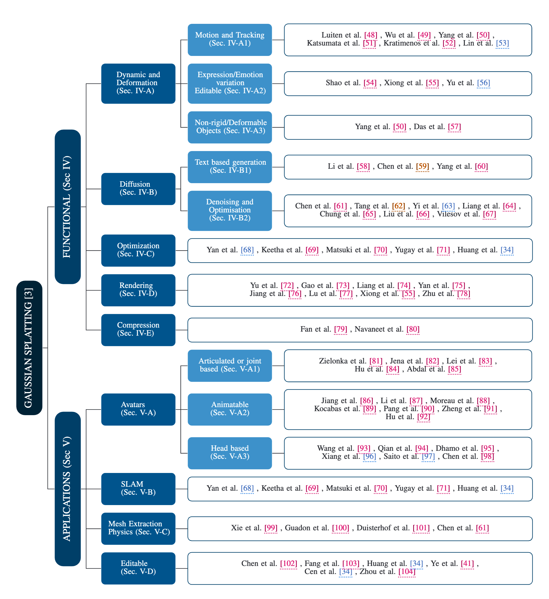

## 功能性

> 拓展3DGS本身的能力

### 动态和变形

> - 拓展的参数列表
>   - **在时间** $ t$的 3D 位置：$[x(t), y(t), z(t)]^\top \in \mathbb{R}^3 $
>   - **在时间** $ t$的 3D 旋转，由四元数表示：$[q_x(t), q_y(t), q_z(t), q_w(t)]^\top \in \mathbb{R}^4 $
>   - **缩放因子**：$[s_x, s_y, s_z]^\top \in \mathbb{R}^3 $
>   - **表示颜色的球谐系数，具有自由度 k**：$h \in \mathbb{R}^{3 \times (k + 1)^2} $
>   - **不透明度**：$o \in \mathbb{R} $

- 动态场景追踪

  - [Dynamic 3D Gaussians: Tracking by Persistent Dynamic View Synthesis](https://dynamic3dgaussians.github.io/)

  - [4D Gaussian Splatting for Real-Time Dynamic Scene Rendering（CVPR 2024）](https://guanjunwu.github.io/4dgs/)

- 动态场景编辑

  - [Control4D: Efficient 4D Portrait Editing with Text（CVPR 2024）](https://control4darxiv.github.io/)

    - [SC-GS: Sparse-Controlled Gaussian Splatting for Editable Dynamic Scenes（CVPR 2024）](https://yihua7.github.io/SC-GS-web/)

### 扩散模型

- 文生3D

  - [GaussianDreamer: Fast Generation from Text to 3D Gaussians by Bridging 2D and 3D Diffusion Models（CVPR 2024）](https://taoranyi.com/gaussiandreamer/)
    - 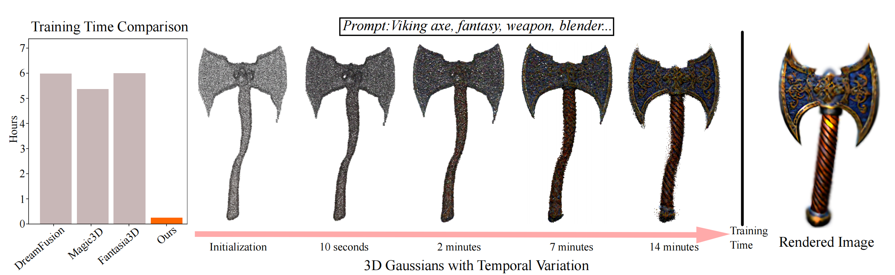
  - [Gsgen: Text-to-3D using Gaussian Splatting（CVPR 2024）](https://gsgen3d.github.io/)

  - [DreamGaussian: Generative Gaussian Splatting for Efficient 3D Content Creation](https://dreamgaussian.github.io/)（ICLR 2024 Oral）

- 去噪和优化
  - [GaussianDiffusion: 3D Gaussian Splatting for Denoising Diffusion Probabilistic Models with Structured Noise](https://www.semanticscholar.org/paper/GaussianDiffusion%3A-3D-Gaussian-Splatting-for-Models-Li-Wang/088d88f44e1f3f4ca7166aba9a363d690981844c)
    - 利用高斯 Splatting 和 Langevin 动力学扩散模型可加速加速渲染并提高真实感。

### 优化和加速

- [Depth-Regularized Optimization for 3D Gaussian Splatting in Few-Shot Images](https://www.semanticscholar.org/paper/Depth-Regularized-Optimization-for-3D-Gaussian-in-Chung-Oh/631288aabfb2045e9d5befd7c5620fcf2ef22243)
- [Compact 3D Gaussian Representation for Radiance Field](https://www.semanticscholar.org/paper/Compact-3D-Gaussian-Representation-for-Radiance-Lee-Rho/9a898d3ebe03a6bd46176b721bc4bb839fe1cdcb)
- [EAGLES: Efficient Accelerated 3D Gaussians with Lightweight EncodingS](https://www.semanticscholar.org/paper/EAGLES%3A-Efficient-Accelerated-3D-Gaussians-with-Girish-Gupta/c7deb4a0a031661e6d886a884fabce433d62cc9c)
- [COLMAP-Free 3D Gaussian Splatting](https://www.semanticscholar.org/paper/COLMAP-Free-3D-Gaussian-Splatting-Fu-Liu/b8eb5493895c8a342cfb176e90f57bc5f483a07c)

### 渲染和着色

- [Mip-Splatting: Alias-free 3D Gaussian Splatting](https://www.semanticscholar.org/paper/Mip-Splatting%3A-Alias-free-3D-Gaussian-Splatting-Yu-Chen/7e305e37b49feb8899ae94f641c4f2d0d01ef054)
- [Relightable 3D Gaussian: Real-time Point Cloud Relighting with BRDF Decomposition and Ray Tracing](https://www.semanticscholar.org/paper/Relightable-3D-Gaussian%3A-Real-time-Point-Cloud-with-Gao-Gu/4314117988b59c9ae108675e55de9ff8fa9dd9a8)
- [GS-IR: 3D Gaussian Splatting for Inverse Rendering](https://www.semanticscholar.org/paper/GS-IR%3A-3D-Gaussian-Splatting-for-Inverse-Rendering-Liang-Zhang/51b93b9a5e5e51d0846f45f54875698ccdd6c231)
- [Multi-Scale 3D Gaussian Splatting for Anti-Aliased Rendering](https://www.semanticscholar.org/paper/Multi-Scale-3D-Gaussian-Splatting-for-Anti-Aliased-Yan-Low/6fc4869263ea4e9dde902d7cd9899436d9826dcc)
- [GaussianShader: 3D Gaussian Splatting with Shading Functions for Reflective Surfaces](https://www.semanticscholar.org/paper/GaussianShader%3A-3D-Gaussian-Splatting-with-Shading-Jiang-Tu/9420a5e441125271d837983e0532ad7c4f76efa6)
- [Scaffold-GS: Structured 3D Gaussians for View-Adaptive Rendering](https://www.semanticscholar.org/paper/Scaffold-GS%3A-Structured-3D-Gaussians-for-Rendering-Lu-Yu/a294b8632fed59e7079ef6187b0afa532c97ed7f)
- [FSGS: Real-Time Few-shot View Synthesis using Gaussian Splatting](https://www.semanticscholar.org/paper/FSGS%3A-Real-Time-Few-shot-View-Synthesis-using-Zhu-Fan/51965f41228e35a798c55613c40dd1499584660b)

### 压缩

- [LightGaussian: Unbounded 3D Gaussian Compression with 15x Reduction and 200+ FPS](https://www.semanticscholar.org/paper/LightGaussian%3A-Unbounded-3D-Gaussian-Compression-Fan-Wang/951facdc297370af63da7f6c36f6b2114dd6b01f)
- [Compact3D: Compressing Gaussian Splat Radiance Field Models with Vector Quantization](https://www.semanticscholar.org/paper/Compact3D%3A-Compressing-Gaussian-Splat-Radiance-with-Navaneet-Meibodi/a2511d30a88268f970d37351a7bca2318a49ceac)

## 应用性

> 3DGS的实际应用

### 数字化身

- 基于铰接式或联合式
- 可动画化
- 基于头部

### SLAM

- GS-SLAM
- [SplaTAM: Splat, Track & Map 3D Gaussians for Dense RGB-D SLAM](https://www.semanticscholar.org/paper/SplaTAM%3A-Splat%2C-Track-%26-Map-3D-Gaussians-for-Dense-Keetha-Karhade/a6c92dd8c537bc4a0c91cef8558e4a4f25416091)
- [Gaussian Splatting SLAM](https://www.semanticscholar.org/paper/Gaussian-Splatting-SLAM-Matsuki-Murai/ec7e33597160535af56f046b8d6914ff49c66e1a)
- [Gaussian-SLAM: Photo-realistic Dense SLAM with Gaussian Splatting](https://www.semanticscholar.org/paper/Gaussian-SLAM%3A-Photo-realistic-Dense-SLAM-with-Yugay-Li/cf9e9390752f659a32659b0441b805ed08a0c093)

### Mesh 提取 + 物理

通过在 3D 高斯中添加更多参数 核速度、应变和其他物理特性可以被建模。

- [PhysGaussian: Physics-Integrated 3D Gaussians for Generative Dynamics](https://www.semanticscholar.org/paper/PhysGaussian%3A-Physics-Integrated-3D-Gaussians-for-Xie-Zong/a40e254265cbe20a746e72c3fa766e370398b740)
- [MD-Splatting: Learning Metric Deformation from 4D Gaussians in Highly Deformable Scenes](https://www.semanticscholar.org/paper/MD-Splatting%3A-Learning-Metric-Deformation-from-4D-Duisterhof-Mandi/09929556fdf26d769ad8751c372d65b0ba3c6682)

### 可编辑性

- [GaussianEditor: Swift and Controllable 3D Editing with Gaussian Splatting](https://www.semanticscholar.org/paper/GaussianEditor%3A-Swift-and-Controllable-3D-Editing-Chen-Chen/bbc6531afdfe41fe8664002a80d9d73a07a080d2)
- [Point'n Move: Interactive Scene Object Manipulation on Gaussian Splatting Radiance Fields](https://www.semanticscholar.org/paper/Point'n-Move%3A-Interactive-Scene-Object-Manipulation-Huang-Yu/c12e2dcf2b07252b9729b4a19ec61d46002a3c94)
- [Gaussian Grouping: Segment and Edit Anything in 3D Scenes](https://www.semanticscholar.org/paper/Gaussian-Grouping%3A-Segment-and-Edit-Anything-in-3D-Ye-Danelljan/5f7867681c6287cc4f4e7fb5260af8067b52b3d9)
- [Segment Any 3D Gaussians](https://www.semanticscholar.org/paper/Segment-Any-3D-Gaussians-Cen-Fang/9c21993421d05bd908ac8498aae134aa2aeb43e3)
- [Feature 3DGS: Supercharging 3D Gaussian Splatting to Enable Distilled Feature Fields](https://www.semanticscholar.org/paper/Feature-3DGS%3A-Supercharging-3D-Gaussian-Splatting-Zhou-Chang/fcdb4cc5202140f41b0181fbbee1b321af4df7ad)

# 对比

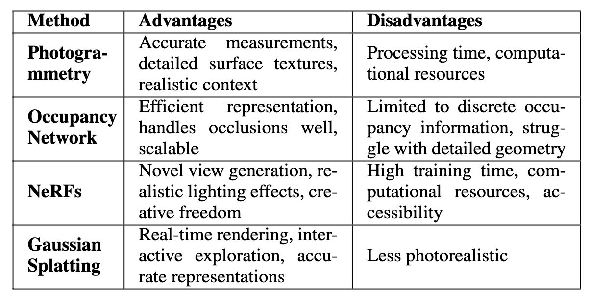

# 总结

## 发展方向

- **交互探索**：实时3D重建技术允许实时交互探索3D场景或模型，并提供即时反馈。
- **动态渲染**：实现动态场景中移动物体或变化环境的实时渲染，增强真实感和沉浸感。
- **模拟与培训**：在汽车、航空航天和医学等领域的模拟和训练环境中提供逼真的视觉反馈。
- **AR****/****VR****体验**：支持沉浸式AR和VR体验的实时渲染，使用户能够实时与虚拟物体或环境互动。
- **技术优势**：提高了计算机图形学、可视化、模拟和沉浸式技术中各应用的效率、互动性和真实性。

高斯散点技术（Gaussian Splatting）在处理动态场景、交互式对象操作、3D分割和场景编辑方面有着广泛的潜在应用和未来发展方向。该技术具有广泛而深远的应用前景，分布在多个领域，包括计算机生成图像（CGI）、虚拟现实/增强现实（VR/AR）、机器人技术、电影与动画、汽车设计、零售、环境研究和航空航天应用等。然而，重要的是要注意到，高斯散点在实现照片级真实性方面可能不及其他方法，比如NeRF（神经辐射场）。

## 局限性

尽管高斯分布渲染（Gaussian Splatting）在整体上取得了出色的结果和令人印象深刻的渲染速度，但这种表示方法的简单性也带来了一些代价。以下是主要的局限性和需要考虑的问题：

### 密集化启发式

在优化过程中，引入了各种密集化启发式，以防止模型出现“破损”的高斯点（如过大、过长或冗余的点）。这些密集化措施对于保持模型的稳定性和一致性至关重要。如果没有这些措施，模型可能会在优化过程中产生问题。

- **过大或过长的高斯点**：如果高斯点的尺寸过大或过长，可能会导致渲染结果失真。
- **冗余的高斯点**：过多的冗余点会增加计算复杂度，而不会显著提高渲染质量。

这些问题在处理超出新视角渲染任务范围的其他任务时可能会进一步放大。

### 离散表示的选择

选择离散表示而非连续表示意味着丧失了多层感知机（MLP）的归纳偏置。在 NeRFs 中，MLP 执行隐式插值，平滑处理视角之间的可能不一致性，而三维高斯点对这些不一致性更加敏感，导致上述问题的出现。

- **MLP** **的插值和平滑**：在 NeRF 中，MLP 可以通过插值和平滑减少视角之间的差异。
- **三维高斯点的敏感性**：三维高斯点在处理这些不一致性时更容易出现问题，导致渲染结果不如 NeRF 平滑。

### 继承的伪影问题

高斯分布渲染继承了一些 NeRF 中存在的已知伪影，这些伪影源于共享的图像形成模型。例如：

- **在较少或未见区域的较低质量**：在训练数据中较少或未出现的区域，渲染质量可能较低。
- **靠近图像平面的浮动伪影**：在靠近图像平面的区域，可能会出现浮动伪影。

这些问题在高斯分布渲染和 NeRF 中都是存在的，源于它们使用的相似图像形成模型。

### 检查点文件大小

检查点文件的大小是另一个需要考虑的属性。尽管新视角渲染尚未被部署到边缘设备，但从磁盘空间的角度来看，三维点的数量和流行的 NeRF MLP 架构占用了相同数量级的磁盘空间，平均而言，高斯分布渲染的文件大小比 NeRF 略大几倍。

- **磁盘空间占用**：高斯分布渲染由于三维点的数量较多，文件大小略大于 NeRF。
- **部署考虑**：虽然目前部署到边缘设备的需求不大，但未来可能需要考虑文件大小对部署的影响。

# 参考资料

1. 3DGS概述
   1. ⭐️ [3D Gaussian Splatting原理速通（一）～（四）](https://www.bilibili.com/video/BV11e411n79b/?vd_source=896adf0655b4e4dfce84eb5e469215df)（29 min watch）
   2. ⭐️ [Gaussian Splatting is pretty cool!](https://aras-p.info/blog/2023/09/05/Gaussian-Splatting-is-pretty-cool/)（10 min read）
   3. ⭐️ [Understanding and Exploring 3D Gaussian Splatting: A Comprehensive Overview](https://logessiva.medium.com/understanding-and-exploring-3d-gaussian-splatting-a-comprehensive-overview-b4004f28ef1c)（9 min read）
   4. [3DGS 官方 Tutorial](https://3dgstutorial.github.io/) （2 hours watch）
   5. [NeRF坑浮沉记3D Gaussian Splatting入门](https://zhuanlan.zhihu.com/p/661569671)（5 min read）
   6. [一文带你入门 3D Gaussian Splatting](https://zhuanlan.zhihu.com/p/680669616)（10 min read）
2. 原理详解
   1. ⭐️ [A Comprehensive Overview of Gaussian Splatting](https://towardsdatascience.com/a-comprehensive-overview-of-gaussian-splatting-e7d570081362)（12 min read）
   2. [Mathematical Supplement for the gsplat Library](https://arxiv.org/pdf/2312.02121)（30 min read）
   3. [NumByNum 3D Gaussian Splatting Reviewed](https://medium.com/@AriaLeeNotAriel/numbynum-3d-gaussian-splatting-for-real-time-radiance-field-rendering-kerbl-et-al-60c0b25e5544)（29 min read）
   4. [EWA Splatting](https://www.cs.umd.edu/~zwicker/publications/EWASplatting-TVCG02.pdf) （30+ min read）
